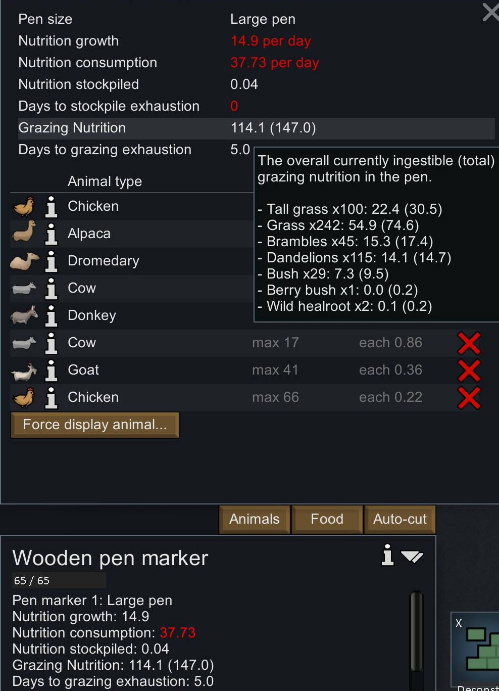
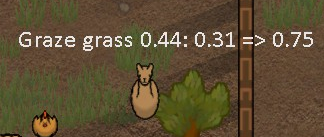
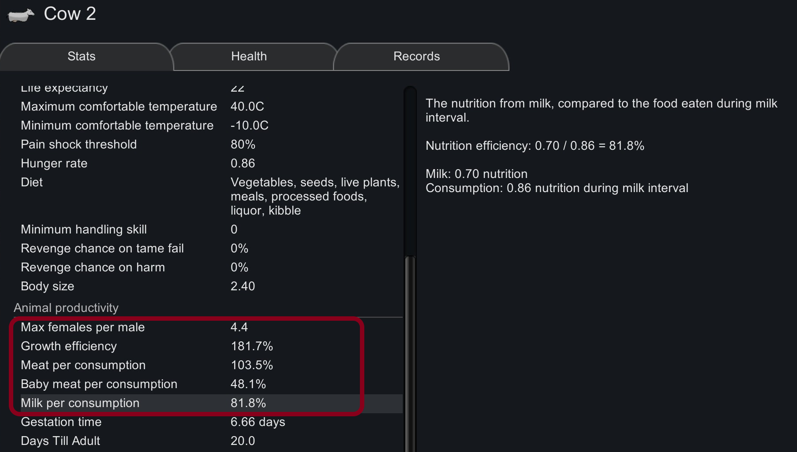

# Grazing Info for RimWorld

Frustrated with animal starving? This is a QoL mod that displays summary of grazing nutrition in the pen along with many useful stats about animal productivity. It provides an option to make player tamed animals eat Dandelion only if it is mature (Default off).

## Features

- It provides an option to make player tamed animals eat Dandelion only if it is mature (Default off).
    - No longer need to manually rotate animals to different pens, in order to maximize nutrition from Dandelion growing zone.
    - For player tamed animals only. Wild animals are not affected.
- It provides an option to show nutrition consumed & food saturation increased as a floating text when animals graze.
- It adds many extra stats on animal info card, e.g. best male to female ratio, nutrition efficiency to farm animals for meat, egg, milk.
- I would expect it to be compatible with most mods. New animals from other mods should also benefit from this change.

## Remarks

- In the base game, the nutrition of a plant is adjusted by its growth.
- The actual nutrition for grazing is growth * this value.
- Note the effect of growth is quadratic. I.e. nutrition per growth is proportional to growth.
- Hence it is wasteful if a plant is consumed prematurely.

